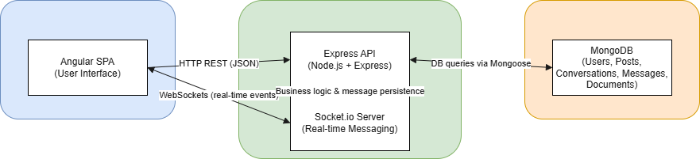
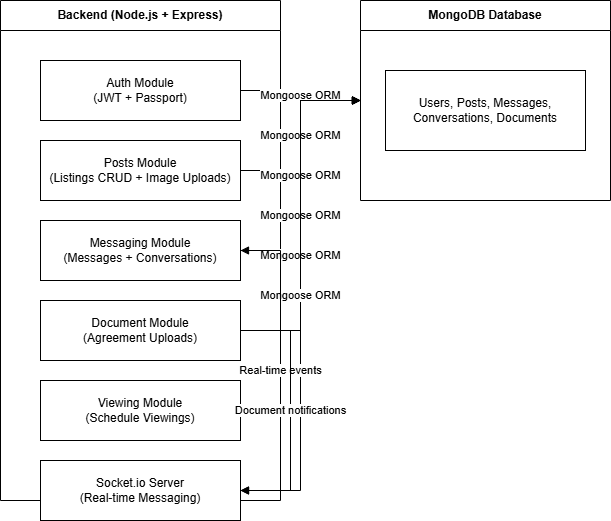
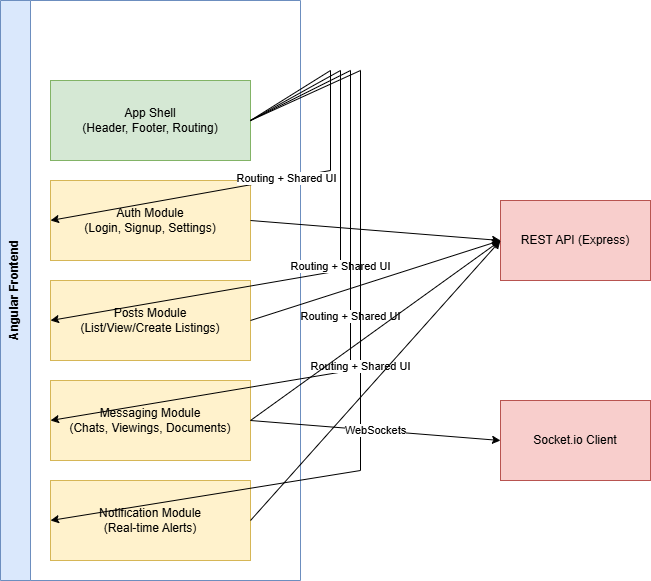
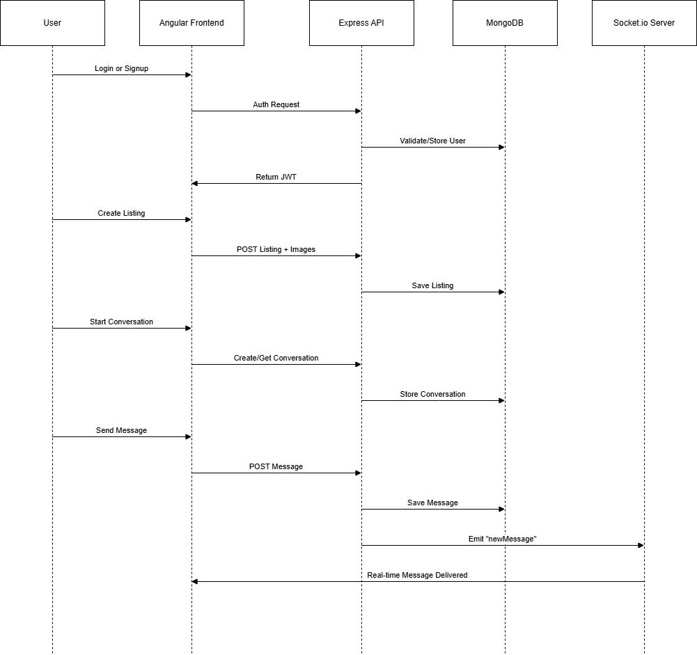

# Rent-Wyse
A Modern Rental Marketplace for Ontario – Listings, Messaging, Viewings & Secure Exchanges.

Rent-Wyse is a full-stack rental marketplace designed to simplify property renting in Ontario.
It currently enables users to create rental listings, chat in real-time, schedule viewings, and exchange rental agreement documents for seamless landlord–tenant communication.

This monorepo contains both the Angular frontend and the Node.js/Express/MongoDB backend.
Each folder includes its own in-depth documentation — this root README gives the high-level architectural overview and conceptual flow of the entire system.

# 🚀 Features (High-Level)

  🔐 User Authentication & Email Verification
  
  🏠 Rental Listings with property details and image uploads
  
  💬 Real-Time Messaging (Socket.io) between landlords & renters
  
  📅 Viewing Date Scheduling per conversation
  
  📄 Agreement & Signed Document Exchange
  
  🔔 Live Notifications for new messages and document updates
  
  🌐 REST API + Angular SPA full-stack architecture
  
# 🏗️ System Architecture Overview

   Below is a concise visualization of the architecture integrating frontend, backend, and data layers.

1. High-Level System Architecture

   

2. Backend Module Architecture (Overview)

   

   Backend readme [https://github.com/sodiqadesina/rentwyse/tree/main/rentwyse-backend/README.md](https://github.com/sodiqadesina/rentwyse/tree/main/rentwyse-backend/README.md)

   

4. Frontend Architecture (Overview)

   

   Frontend readme [https://github.com/sodiqadesina/rentwyse/rentwyse-frontend/README.md](https://github.com/sodiqadesina/rentwyse/tree/main/rentwyse-frontend)

5. Application Workflow (End-to-End Lifecycle)

  

# Project Structure (Monorepo)

```
Rent-wyse/
│
├── rentwyse-frontend/      # Angular 16 SPA (User Interface)
│   └── README.md           # Detailed frontend documentation
│
├── rentwyse-backend/       # Node.js + Express + MongoDB API
│   └── README.md           # Detailed backend documentation
│
└── README.md               # (This file) Root system overview
```


# ⚙️ Technology Stack

  - Frontend
      - Angular 16
      
      - Angular Material
      
      - RxJS
      
      - Socket.io Client
      
      - Bootstrap (styling utilities)
    
  - Backend
  
      - Node.js / Express
      
      - Passport.js + JWT Authentication
      
      - Socket.io (real-time communication)
      
      - Multer (file uploads)
      
      - Mongoose / MongoDB
      
      - Nodemailer (email verification)

# 🛠️ Getting Started (Development)
  
1. Clone the repository
  ```
  cd rentwyse-backend
  npm install
  ```

2. Backend Setup

  - Create a .env file:
    ```
    MONGO_ATLAS_CONNECTION=your_db_uri
    JWT_KEY=your_jwt_key
    EMAIL_USER=your_email
    EMAIL_PASS=your_app_password
    ```
  - Start backend:
  ```
    npm run dev
    # or
    nodemon server.js

  ```
    Runs on http://localhost:5500

3. Frontend Setup
  ```
  cd rentwyse-frontend
  npm install
  ng serve
  ```
  Open: http://localhost:4200
    
# Future Enhancements

  - Add dedicated admin dashboard

  - Integrate full PayPal payment flow

  - Add listing analytics (views, saves, leads)

  - Add image compression + preview processing

  - Add push notifications (Firebase Cloud Messaging)

# Demo:
  - visit https://rentwyse-jkw3.onrender.com for a demo
  - use testuser1 and/or testuser2 as username and password = Password123! to login 
  - happy testing 
      
