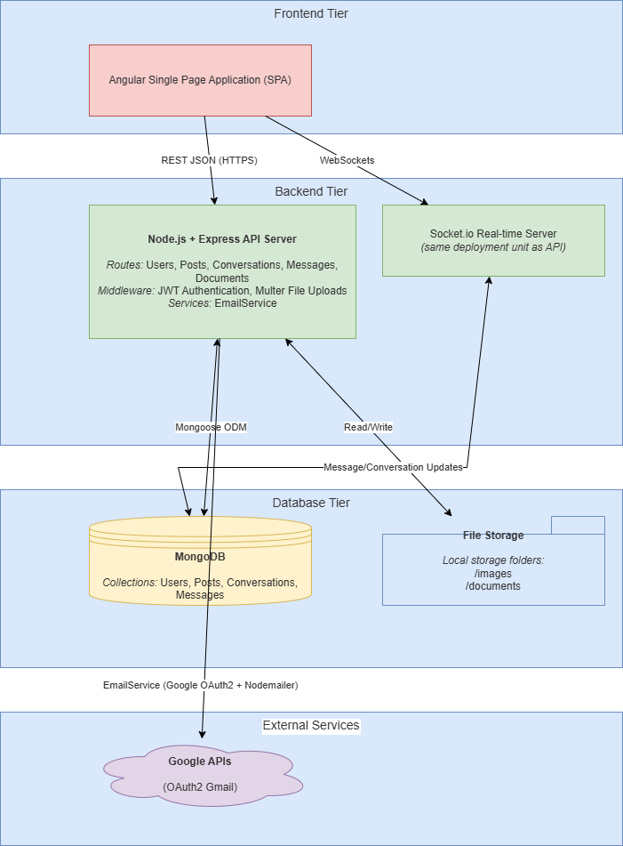
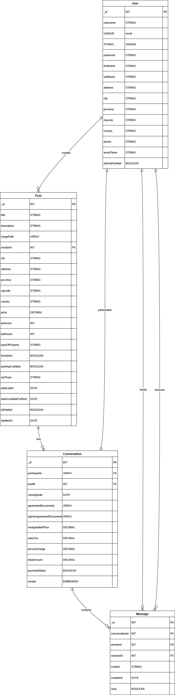

# Rent-Wyse Backend (Node.js + Express + MongoDB + Socket.io)

The Rent-Wyse Backend powers the full-stack rental marketplace enabling secure messaging, real-time communication, listing management, document exchange, and landlord–tenant deal flow.
This service exposes a REST API, WebSocket server, file upload pipeline, authentication system, and email verification engine.

# ⭐ Features

  🔐 Authentication & Users
  
  - JWT authentication (Passport JWT)
  
  - Password hashing (bcrypt)
  
  - Email verification via Google OAuth2 + Nodemailer
  
  - Profile retrieval & update
  
  - Change password workflow
  
  🏠 Listings / Posts
  
  - Create, update, delete, and search rental listings
  
  - Image upload with Multer → /images/
  
  - Soft-delete mechanism
  
  💬 Real-time Messaging
  
  - One-to-one conversations linked to listings
  
  - Offline message queueing
  
  - Read receipts & unread message tracking
  
  - Socket.io server integrated with Express
  
  📄 Agreements & Document Handling
  
  - Upload agreement files
  
  - Upload signed agreement files
  
  - Delete documents
  
  - Secure document viewing endpoints
  
  - File storage → /documents/
  
  📅 Viewing Dates
  
  - Landlords can set viewing dates for tenants
  
  - Automatic real-time notification via Socket.io
  
  
  🚧🚧 more features coming 🚧🚧
        /!\ 
       /___\   UNDER CONSTRUCTION
      (_____)

# 🧱 Tech Stack
  | Layer     | Technology                 |
  | --------- | -------------------------- |
  | Runtime   | Node.js                    |
  | Framework | Express                    |
  | Real-time | Socket.io                  |
  | Database  | MongoDB + Mongoose         |
  | Auth      | Passport Local + JWT       |
  | Email     | Nodemailer + Google OAuth2 |
  | Uploads   | Multer                     |
  | Security  | bcrypt, JWT                |
  | Env       | dotenv                     |

      
# 📂 Project Structure 
```
rentwyse-backend/
│── server.js                 # Entry point (HTTP + Socket.io)
│── app.js                    # Express configuration
│── socket.js                 # Realtime server logic
│── .env                      # Environment variables
│
├── config/
│   ├── passport-config.js    # Local & JWT strategies
│   ├── bcrypt-config.js      # Password hashing helpers
│   └── papalConfig.js        # PayPal config (future)
│
├── controllers/
│   ├── userController.js
│   ├── PostsController.js
│   ├── messageController.js
│   ├── conversationController.js
│   └── KycController.js
│
├── middleware/
│   ├── check-auth.js         # JWT middleware
│   ├── file.js               # Image upload
│   └── documents.js          # Agreements upload
│
├── models/
│   ├── user.js
│   ├── post.js
│   ├── conversation.js
│   └── message.js
│
├── routes/
│   ├── user.js
│   ├── posts.js
│   ├── conversations.js
│   ├── messages.js
│   └── kyc.js
│
├── images/                   # Uploaded listing images
└── documents/                # Uploaded agreements
```








# ⚙️ Setup & Installation
1. Clone Repository
```
  git clone https://github.com/sodiqadesina/rentwyse.git
  cd rentwyse/rentwyse-backend
```
2. Install Dependencies
```
npm install
```
4. Create .env File
```
PORT=3000
MONGODB_URI=your_mongodb_connection
JWT_KEY=your_jwt_secret
GOOGLE_CLIENT_ID=xxx
GOOGLE_CLIENT_SECRET=xxx
GOOGLE_REFRESH_TOKEN=xxx
GOOGLE_REDIRECT_URI=xxx
EMAIL_USER=your-email@gmail.com
```
4. Start Server
Development
```
npm run dev
```
Production
```
npm start
```

Server runs at
```
http://localhost:3000
```

# 🔌 API Overview
  User Routes – /api/user
  | Method | Route              | Description                        |
  | ------ | ------------------ | ---------------------------------- |
  | POST   | `/signup`          | Register & send email verification |
  | GET    | `/verify-email`    | Verify email token                 |
  | POST   | `/login`           | Login (JWT issued)                 |
  | GET    | `/me`              | Get logged-in user profile         |
  | PATCH  | `/update`          | Update profile                     |
  | PATCH  | `/change-password` | Change password                    |
  

  Posts Routes – /api/posts
  | Method | Route  | Description                    |
  | ------ | ------ | ------------------------------ |
  | POST   | `/`    | Create listing (+ images)      |
  | GET    | `/`    | Fetch all or filtered listings |
  | GET    | `/:id` | Get one post                   |
  | PUT    | `/:id` | Update listing                 |
  | DELETE | `/:id` | Soft delete                    |
  

  Messaging Routes – /api/messages
  | Method | Route                   | Description                     |
  | ------ | ----------------------- | ------------------------------- |
  | POST   | `/`                     | Send a message                  |
  | GET    | `/conversation/:id`     | Get messages for a conversation |
  | PATCH  | `/read/:conversationId` | Mark messages as read           |
  | GET    | `/unread-count`         | Unread count for user           |
  
  Socket events:

  - message
  
  - conversationUpdated
  
  - Offline messages queueing 

  Conversations Routes – /api/conversations
  | Method | Route                 | Description                    |
  | ------ | --------------------- | ------------------------------ |
  | POST   | `/start`              | Start or retrieve conversation |
  | GET    | `/`                   | Get all conversations for user |
  | GET    | `/:id/messages`       | Messages inside a convo        |
  | PATCH  | `/setViewingDate/:id` | Landlord sets viewing date     |


  Document Routes
  | Method | Route                           | Description          |
  | ------ | ------------------------------- | -------------------- |
  | POST   | `/:id/uploadAgreement`          | Upload agreement doc |
  | POST   | `/:id/uploadSignedAgreement`    | Upload signed doc    |
  | DELETE | `/:id/deleteDocument/:filename` | Delete a document    |
  | GET    | `/view/:filename`               | Serve a document     |


  🚀 Deployment Notes

  The backend can be deployed on:
  
  - Azure Web App
  
  - Render Web Service
  
  - AWS Elastic Beanstalk or EC2
  
  - Heroku alternative platforms
  
  Checklist:
  
  - Use Node 20+
  
  - Ensure writable folders: /images, /documents
  
  - Configure environment variables on the server
  
  - Enable CORS for frontend domain
  
  - Use reverse proxy for WebSockets (NGINX / Azure Web App)

  🧪 Testing
  Run with Postman:
  
  - Test signup → verify email → login
  
  - Send messages between two users in separate browsers
  
  - Upload agreement documents
  
  - Set viewing dates
  
  - Delete documents and confirm UI refresh
  
  🛠️ Future Improvements
  
  - PayPal or Stripe payment integration
  
  - Redis for socket scaling
  
  - Automated cleanup of soft-deleted posts
  
  - Rate limiting & IP throttling
  
  - Database indexing optimization
  
  - KYC module completion


      /!\ 
     /___\   UNDER CONSTRUCTION
    (_____)


# rentwyse 🚧 👷 🔨 🛠️ 🔧🚧 UNDER CONSTRUCTION 🚧🔧  rentwyse #


