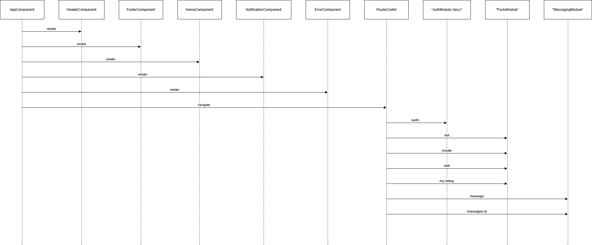
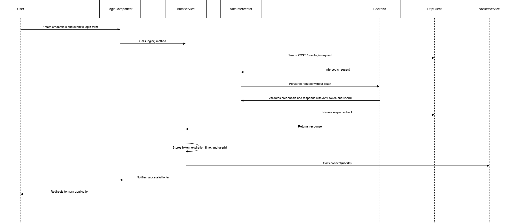
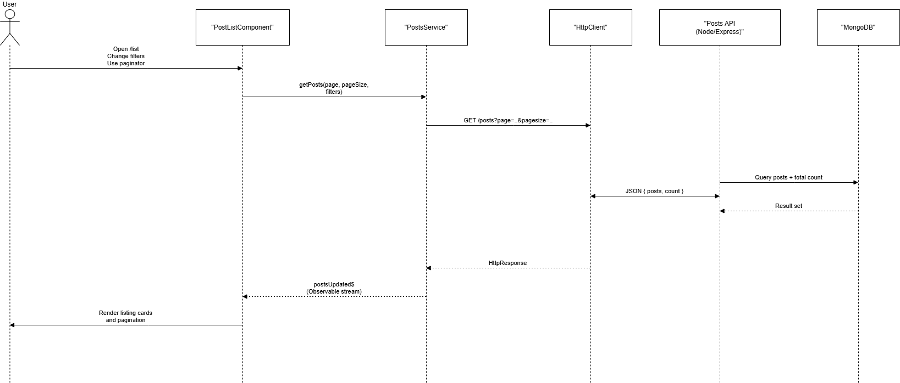
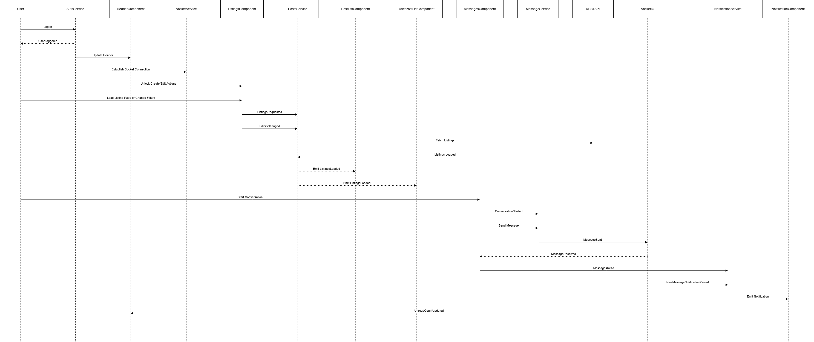

# Rent-Wyse Frontend (Angular 17)

Modern Single-Page Application for a full-stack rental marketplace.

## 📌 Overview
Rent-Wyse Frontend is a feature-rich Angular SPA that powers the user interface of the Rent-Wyse rental marketplace.

It provides:

- Property browsing & filtering

- Listing creation & management

- Real-time messaging between tenants & landlords

- JWT authentication system

- WebSocket notifications

- File uploads (images & documents)

- Dialog-driven interactions (inquiries, confirmations, edits)

This frontend communicates with:

- Node.js/Express REST API (HTTP + JSON)

- Socket.io server (WebSockets)

- MongoDB (via backend)


# 🛠️ Technology Stack
| Layer        | Technology                                |
| ------------ | ----------------------------------------- |
| UI Framework | **Angular 17 (SPA)**                      |
| Styling      | Angular Material, Flex Layout, Custom CSS |
| State        | RxJS, Subjects/BehaviorSubjects           |
| Messaging    | Socket.io-client                          |
| HTTP         | Angular HttpClient + JWT AuthInterceptor  |
| Dialogs      | Angular Material Dialog                   |
| Forms        | Reactive Forms                            |
| Routing      | Angular Router                            |

# Project Structure 
```
src/app/
│
├── auth/
│   ├── login/
│   ├── signup/
│   ├── settings/
│   ├── auth.service.ts
│   ├── auth-interceptor.ts
│   ├── auth-guard.ts
│
├── posts/
│   ├── post-list/
│   ├── post-create/
│   ├── user-post-list/
│   ├── posts.service.ts
│
├── messaging/
│   ├── messages/
│   ├── inquiry-dialog/
│   ├── delete-confirmation/
│   ├── messaging.service.ts
│
├── notification/
│   ├── notification.component.ts
│   ├── notification.service.ts
│   ├── socket.service.ts
│
├── header/
├── footer/
├── home/
├── error/
├── loading/
└── app.component.ts
```
# ⚙️ Frontend Architecture

The Angular application is structured using feature-based modules, core services, and cross-cutting infrastructure (interceptors, guards, sockets).

 

🧩 Frontend Component Rendering & Routing Flow 

This sequence diagram illustrates the initial application rendering flow and how routing determines which feature module is loaded in the Rent-Wyse Angular frontend.

1. AppComponent bootstraps the entire application, acting as the root shell.

2. It immediately triggers the rendering of shared layout components:

    - HeaderComponent
    
    - FooterComponent
    
    - HomeComponent (default landing view)
    
    - NotificationComponent (for real-time socket alerts)
    
    - ErrorComponent (for global error handling)

3. When a user interacts with the UI (for example clicking a button or selecting a menu item), the HomeComponent instructs the application to navigate using the Router.

4. The RouterOutlet receives the navigation request and determines which module to load:

    - Navigating to /auth/... loads the lazy-loaded AuthModule
    
    - Navigating to /list, /create, /edit/:id, /my-listing loads the PostsModule
    
    - Navigating to /message or /messages/:id loads the MessagingModule

5. Each route triggers the appropriate feature module and its components to render inside the RouterOutlet, while the AppComponent layout (header, footer, notification, etc.) remains persistent.


# 🔐 Authentication Flow

  Components & services:
  
  - AuthService
  
  - AuthInterceptor
  
  - AuthGuard
  
  - LoginComponent, SignupComponent
  
  - ErrorInterceptor


  

This diagram illustrates the end-to-end user authentication flow in the Rent-Wyse frontend, showing how Angular components, services, the interceptor pipeline, and the backend coordinate to complete a secure login.

1. User submits credentials in the login form displayed by the LoginComponent.

2. The LoginComponent triggers the login process by calling AuthService.login().

3. AuthService prepares the request and sends a POST /user/login call through Angular’s HttpClient.

4. Before reaching the backend, the request passes through the AuthInterceptor, which:

    - intercepts the request,
    
    - detects that no token should be applied (this is a login call),
    
    - forwards the request unchanged to the backend.

5. The Backend validates the credentials.
    If valid, it returns:

    - a JWT authentication token,

    - its expiration time,
    
    - the authenticated userId.

6. The response flows back through the interceptor to HttpClient, and then back to AuthService.

7. AuthService processes the successful login response:

    - Stores the token, expiration timestamp, and userId in memory and localStorage.
    
    - Updates the internal authentication state.
    
    - Establishes a real-time connection by calling SocketService.connect(userId).

8. AuthService notifies the LoginComponent that authentication succeeded.

9. The LoginComponent performs a client-side redirect to load the main authenticated application interface.
  
# 🏘️ Post / Listing Feature Architecture

  Key files:
  
  - posts.service.ts
  
  - post-list.component.ts
  
  - post-create.component.ts
  
  - user-post-list.component.ts

  

  This diagram illustrates how the Rent-Wyse frontend retrieves and displays property listings when the user opens the /list page or interacts with filters and pagination.

  1. The User navigates to /list, changes search filters, or interacts with the paginator.
  These actions cause the PostListComponent to refresh the listing data.
  
  2. PostListComponent calls:
    - PostsService.getPosts(page, pageSize, filters),
    - requesting posts for the current view.
  
  3. PostsService sends an HTTP request using Angular’s HttpClient:
  GET /posts?page=..&pagesize=..
  
  4. HttpClient forwards the request to the Posts API (Node/Express).
  
  5. The backend queries MongoDB for:
    - the list of posts for the requested page
    - the total result count for pagination
  
  6. MongoDB returns the records to the backend, which then responds with:
  JSON { posts, count }
  
  7. HttpClient passes this response to PostsService.
  
 8.  PostsService updates its postsUpdated$ observable, pushing:
  
     - the new list of posts
      
     - the updated total count
    
  9. PostListComponent subscribes to postsUpdated$, receives the updated data, and renders the listing cards and pagination controls for the user.

# 💬 Messaging & Conversations

  Full real-time chat with:
  
  Conversation threads
  
  - Message history
  
  - Typing & sending
  
   - Document sharing
  
  - Viewing date scheduling
  
  - Price renegotiation
  
  - Socket-based notifications

  Key files:
  
  - messaging.service.ts
  
  - messages.component.ts
  
  - socket.service.ts
  
  - notification.service.ts


# 📡 Real-Time Notification Flow

  - Backend emits "newMessage"
  
  - SocketService receives it
  
  - NotificationService stores it
  
  - NotificationComponent displays MatSnackBar
  
  - Header badge updates unread count

# 🧠 Component - Service Relationships
| Component                | Depends On                                 | Purpose                                      |
| ------------------------ | ------------------------------------------ | -------------------------------------------- |
| `PostListComponent`      | PostsService, AuthService, MatDialog       | List properties, start conversations         |
| `PostCreateComponent`    | PostsService, AuthService                  | Create / edit listings                       |
| `UserPostListComponent`  | PostsService                               | Show user-owned posts                        |
| `MessagesComponent`      | MessageService, SocketService, AuthService | All messaging functionality                  |
| `InquiryDialogComponent` | MessageService, MatDialogRef               | Start/get conversation, send initial message |
| `NotificationComponent`  | NotificationService, SocketService         | Real-time alerts                             |
| `HeaderComponent`        | AuthService, MessageService                | Auth state + unread badge                    |
| `Login/Signup`           | AuthService                                | Auth lifecycle                               |
| `ErrorComponent`         | ErrorInterceptor                           | Global error UI                              |

# topics & subscriptions



This domain event map shows how the main frontend contexts (Auth, Listings, Messaging, Notification/Shell) communicate using domain events instead of tight coupling.

- When a user logs in, the AuthService raises UserLoggedIn, which triggers the header to update, the socket connection to be established, and listing components to unlock create/edit actions.

- When the listing page loads or filters change, ListingsRequested and FiltersChanged flow into PostsService, which calls the backend and then emits ListingsLoaded, consumed by PostListComponent and UserPostListComponent.

- The messaging flow uses events like ConversationStarted, MessageSent, MessageReceived, and MessagesRead to coordinate between MessagesComponent, MessageService, the REST API, and the Socket.io server.

- Notifications and unread message badges are driven by MessageReceived, UnreadCountUpdated, and NewMessageNotificationRaised, which connect SocketService, NotificationService, NotificationComponent, and HeaderComponent.

🔐 AuthService – authStatusListener: Subject<boolean>
  
Topic: “Is the user authenticated?”

Defined in: auth.service.ts
  - Emits true on:
  - successful login
  - successful autoAuthUser() (when restoring from localStorage)
  - Emits false on:
  - login/signup error
  - logout() 
  
Publishers:
  - createUser(...) (on failure / after dialog)
  - login(...) (on success or error)
  - autoAuthUser()
  - logout()

Subscribers:
  - HeaderComponent
    - Subscribes via authService.getAuthStatusListener()
    - Updates userIsAuth so the nav bar shows/hides links appropriately.
  - PostListComponent
  - PostCreateComponent
  - UserPostListComponent
    - All three subscribe to update:
      - userIsAuth (to show/hide edit/delete)
      - userId (to check if the current user is the creator of a post).
  - NotificationComponent
    - Subscribes so it can connect/disconnect the socket when login state changes.
  - SignupComponent / LoginComponent
    - Use it to drive their local isLoading flags and react to auth errors/success.
   
 🏘 PostsService – postsUpdated: Subject<{ posts, postCount }>

Topic: “Current listing results for the active query/page”

Defined in: posts.service.ts

Publishers:

  - getPosts(postsPerPage, currentPage, filters...)
  
  - getPostsByUserId(postsPerPage, currentPage)

Each method:

  - Builds the query string (including filters).
  
  - Does HttpClient.get(...).
  
  - Maps raw JSON into your post model.
  
  - Calls:
```
this.posts = postData.posts;
this.postsUpdated.next({
  posts: [...this.posts],
  postCount: postData.maxPost
});
```
Subscribers:

  - PostListComponent
``` this.postsSub = this.postsService.getPostUpdateListener()
  .subscribe((postData) => {
    this.isLoading = false;
    this.totalPosts = postData.postCount;
    this.posts = postData.posts;
  });
```
- UserPostListComponent
   - Same pattern, but restricted to posts of the logged-in user.
 
💬 MessageService – unreadMessageCount: BehaviorSubject<number>

Topic: “Global unread messages badge count”

Defined in: messaging.service.ts

Publishers:

  - fetchUnreadMessageCount()
  
    - Called after marking messages as read.
    
    - Called from Notification flow when new messages arrive.
    
  - Any place that calls updateUnreadMessageCount(...) directly.

Subscribers:

  - HeaderComponent
  ```
  this.messageService.getUnreadMessageCount()
    .subscribe(count => this.unreadMessageCount = count);
  ```
  Displays the value as a badge in the header.
  - MessagesComponent
    After:
    ```
    this.messageService.markMessagesAsRead(conversationId).subscribe(() => {
    this.messageService.fetchUnreadMessageCount();
    });
    ```
    So the header badge stays in sync when a conversation is opened and messages are read.

  - NotificationComponent
  
    - Calls fetchUnreadMessageCount() whenever real-time notifications arrive, so the badge updates when the user doesn’t have the Messages page open.
   
 🔔 NotificationService – newMessages$: BehaviorSubject<any[]>

  Topic: “Queue of new real-time messages from WebSocket”
  
  Defined in: notification.service.ts
  ```
  private newMessagesSource = new BehaviorSubject<any[]>([]);
newMessages$ = this.newMessagesSource.asObservable();

pushNewMessage(message: any) {
  const current = this.newMessagesSource.getValue() || [];
  this.newMessagesSource.next([...current, message]);
}

clearMessages() {
  this.newMessagesSource.next([]);
}
```
Publishers:

- SocketService.connect(userId)
```
this.socket.on('connect', () => {
  this.socket.emit('registerUser', userId);
  this.onNewMessage((data) => {
    console.log(data);
    this.notificationService.pushNewMessage(data);
  });
});

```
Every newMessage event from the server gets pushed into the queue.

Subscribers:
- NotificationComponent
```
this.messageSubscription = this.notificationService.newMessages$
  .subscribe(messages => {
    if (messages.length > 0) {
      this.showNotifications(messages);
      this.notificationService.clearMessages();
    }
  });

```
- Shows snackbars for each new message.

- Clears the queue after display.

- Inside showNotifications, it also calls messageService.fetchUnreadMessageCount() to refresh the unread badge.

🌐 SocketService – “newMessage” event stream

This isn’t an RxJS Subject, but effectively a topic from the server:

- socket.on('newMessage', ...) inside SocketService.

- Two key consumers:

  - NotificationService (via pushNewMessage) for global notifications.
  
  - MessagesComponent via socketService.onNewMessage(...) for live updates in the open conversation:

    - It increments conversation.unreadCount for other threads.
    
    - Refreshes the currently open conversation if the message belongs there.
   
⏳ LoadingService – isLoading: BehaviorSubject<boolean>

Topic: “Global loading state”

Defined in: loading.service.ts
```
isLoading = new BehaviorSubject<boolean>(false);

startLoading()  { this.isLoading.next(true);  }
stopLoading()   { this.isLoading.next(false); }
```
- Designed to support a global spinner.

- Right now, most components use their own isLoading boolean locally (Login, Signup, Settings, PostList, UserPostList), but the service is there we will centralize that later.

🧭 Router-based topics (non-Subject, but still subscriptions)

There are also a few important Angular Router observables that play like topics:

- PostListComponent

  - route.queryParams.subscribe(...)

    - Drives the city filter when navigating from Home.

- MessagesComponent

  - route.params.subscribe(params => { conversationId })

    - Opens a specific conversation when you go to /messages/:conversationId.

These are not Subjects, but they’re still subscription-based flows that connect modules.

🚧 👷 🔨 🛠️ 🔧🚧 UNDER CONSTRUCTION 🚧🔧   
=========================================================================================
    
# API Integration
  REST Endpoints Used:
  
    - /user/login
    
    - /user/signup
    
    - /posts/...
    
    - /user-post/...
    
    - /messages/...
    
    - /conversations/...
  
  WebSockets:
  
    connect(userId)
    
    disconnect()
    
    Listen for "newMessage"

